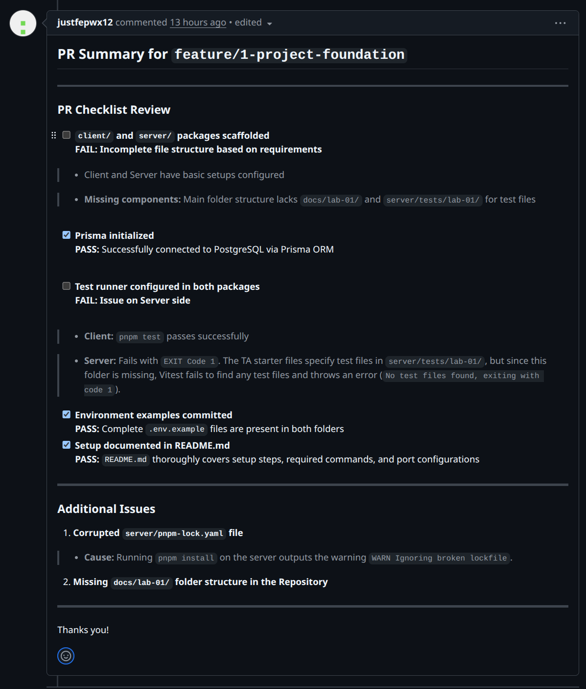

# Lab 1 — Peer Review Record  (fill this in)

**Author:** Nakagamon Saengdara — 67070501064 — GitHub: @fahsai-02

**Peer reviewer:** Onsinee Chotchuangsakulchai — 67070501078 — GitHub: @justfepwx12

## Pull Requests I authored (reviewed by my partner)
| PR | Branch | Reviewer verdict |
|----|--------|------------------|
| 17 | feature/1-project-foundation | not-approved |
|    | feature/2-health-check |  |
|    | feature/3-category-seed |  |
|    | feature/4-category-list |  |

**#17 feature/1-project-foundation**

Reviewer comment I received: 

How I responded: 
I added the missing docs/ folder, and added a test file under server/tests/lab-01/ so `pnpm test` runs. The lockfile warning was caused by a pnpm version mismatch, it works with pnpm 11.20.0.

## Pull Requests I reviewed for my partner
My comment: <...>

Partner's response: <...>
