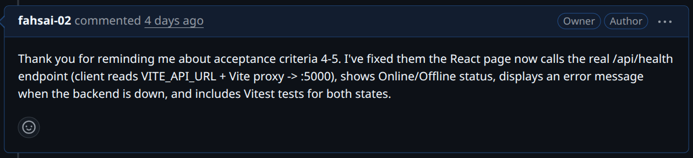
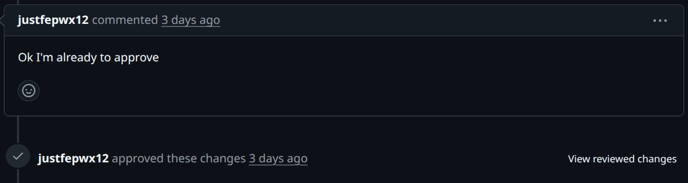
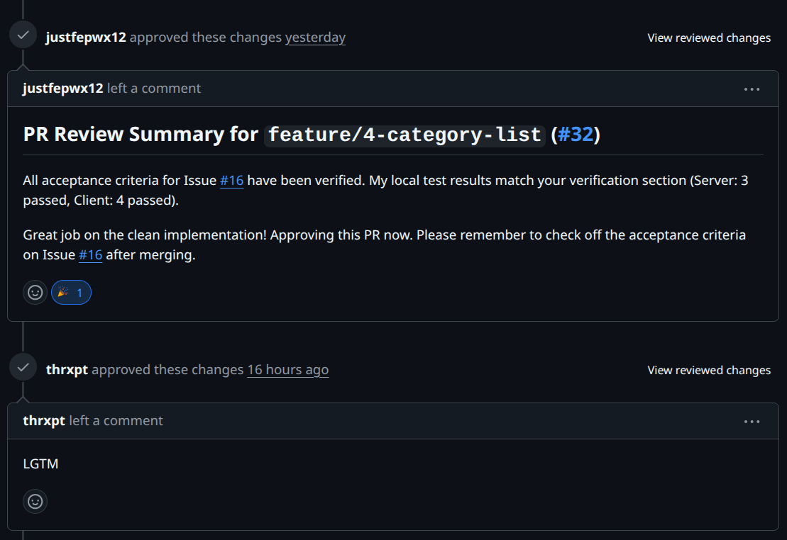
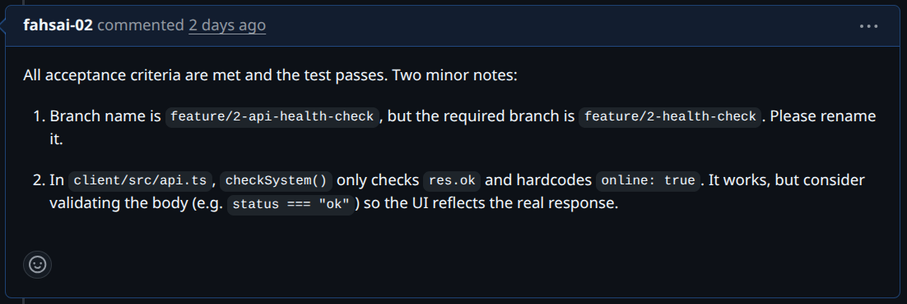
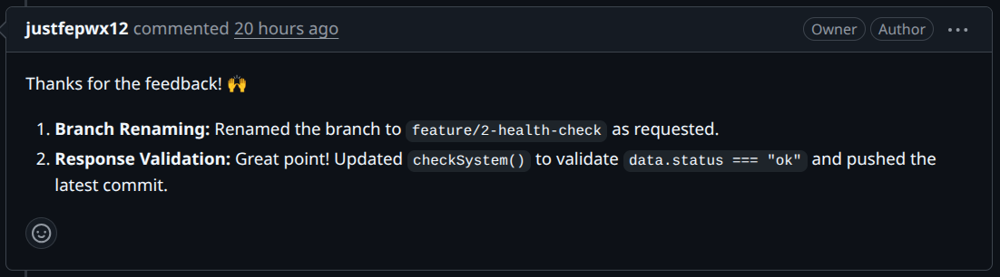
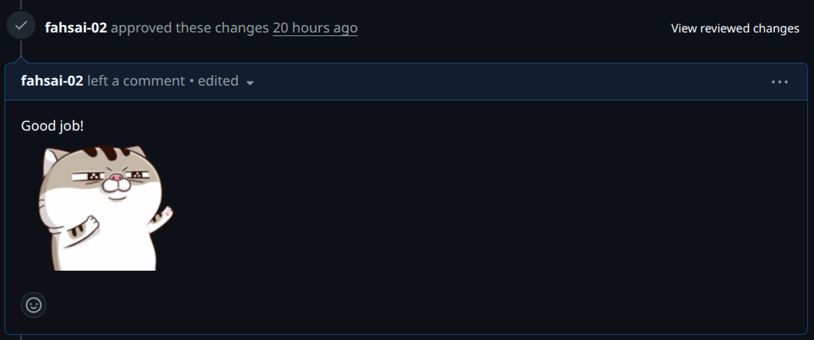
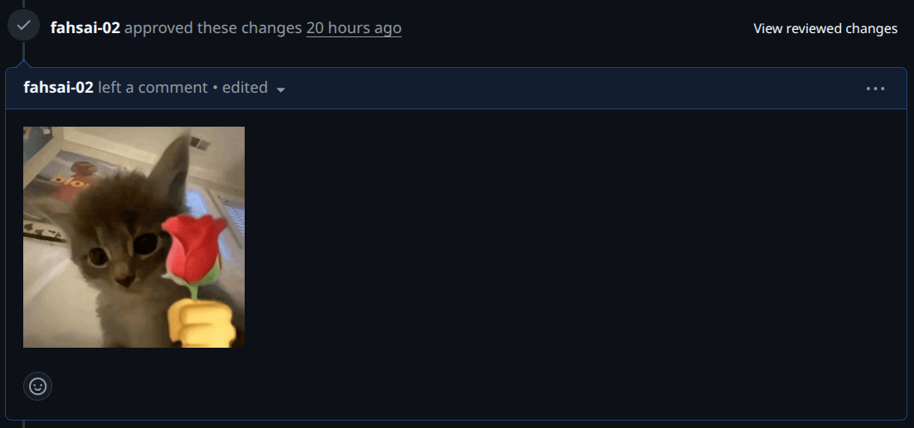
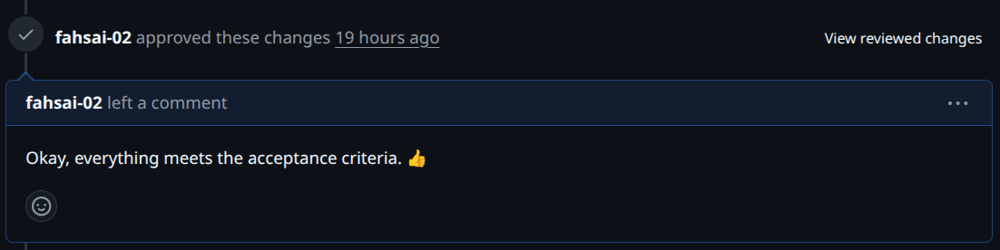
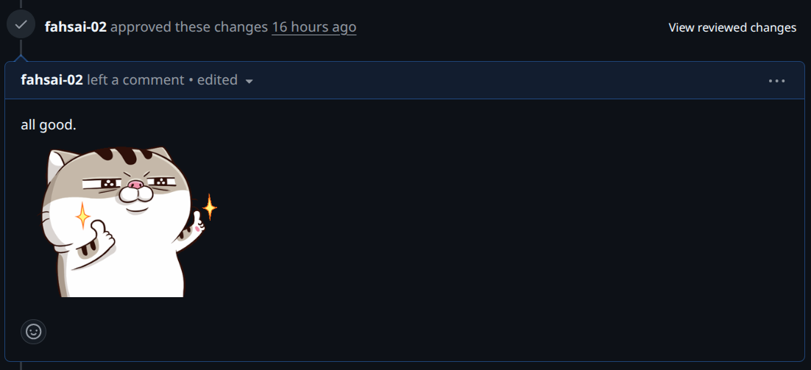

# Lab 1 — Peer Review Record

**Author:** Nakagamon Saengdara — 67070501064 — GitHub: @fahsai-02

## Pull Requests I authored (reviewed by my partner)
| PR | Branch | Reviewer verdict |
|----|--------|------------------|
| 17 | feature/1-project-foundation | approved |
| 21 | feature/2-health-check | approved |
| 25 | feature/3-category-seed | approved |
| 32 | feature/4-category-list | approved |

### feature/1-project-foundation #17

**Peer reviewer:** Onsinee Chotchuangsakulchai — 67070501078 — GitHub: @justfepwx12

Reviewer comment I received:  

How I responded:  

Reviewer approved comment :  

---

### feature/2-health-check #21

**Peer reviewer:** Onsinee Chotchuangsakulchai — 67070501078 — GitHub: @justfepwx12

Reviewer comment I received:  

How I responded:  

Reviewer approved comment :  

---

### feature/3-category-seed #25

**Peer reviewer:** Theeraphat Jaingam — 67070501063 — GitHub: @thrxpt

Reviewer approved comment :  

---

### feature/4-category-list #32

**Peer reviewer:** Theeraphat Jaingam — 67070501063 — GitHub: @thrxpt  
**Peer reviewer:** Onsinee Chotchuangsakulchai — 67070501078 — GitHub: @justfepwx12

Reviewer approved comment :  

---

## Pull Requests I reviewed for my partner

### feature/1-project-foundation

**Pull Requests URL:** <https://github.com/justfepwx12/TokTikIT-CPE334-Software-Engineering/pull/22>

My comment:  

Partner's response:  

My approved comment:  

---

### feature/2-health-check

**Pull Requests URL:** <https://github.com/justfepwx12/TokTikIT-CPE334-Software-Engineering/pull/26>

My comment:  

Partner's response:  

My approved comment:  

---

### feature/3-category-seed

**Pull Requests URL:** <https://github.com/justfepwx12/TokTikIT-CPE334-Software-Engineering/pull/25>

My approved comment:  

**Pull Requests URL:** <https://github.com/thrxpt/toktickit/pull/7>

My approved comment:  

---

### feature/4-category-list

**Pull Requests URL:** <https://github.com/thrxpt/toktickit/pull/8>

My approved comment:  

---
