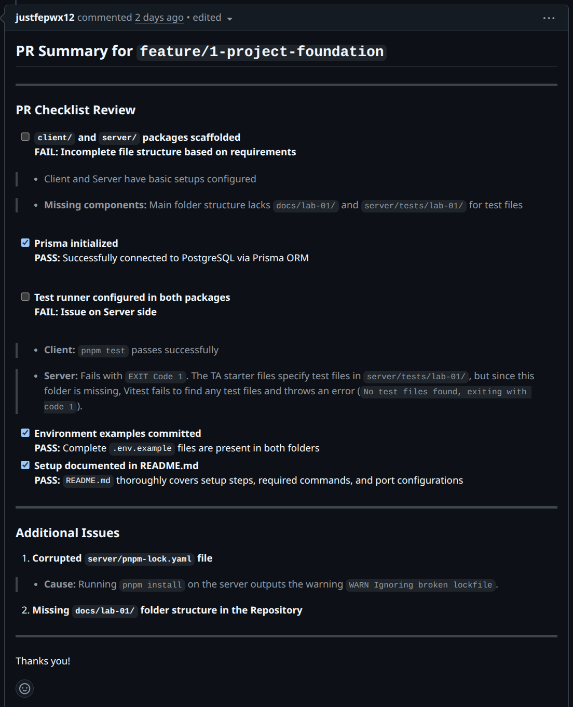
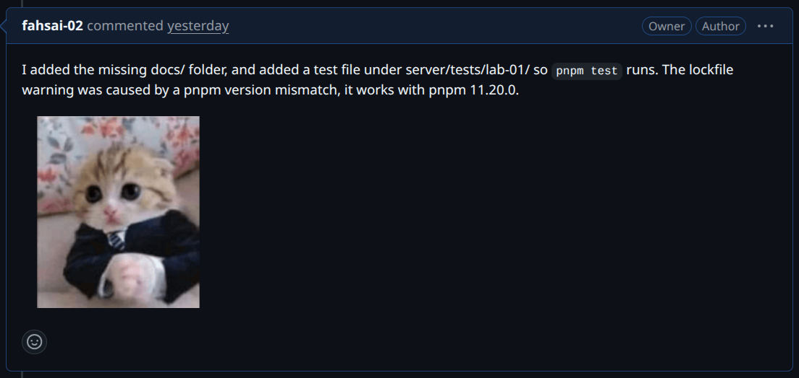
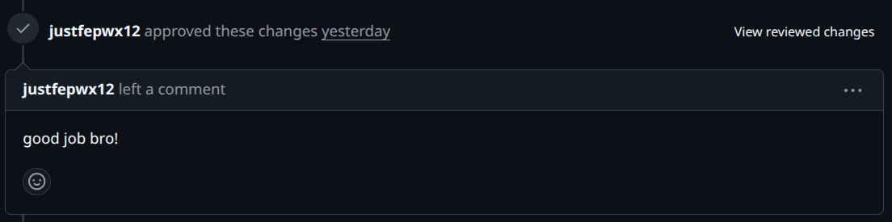
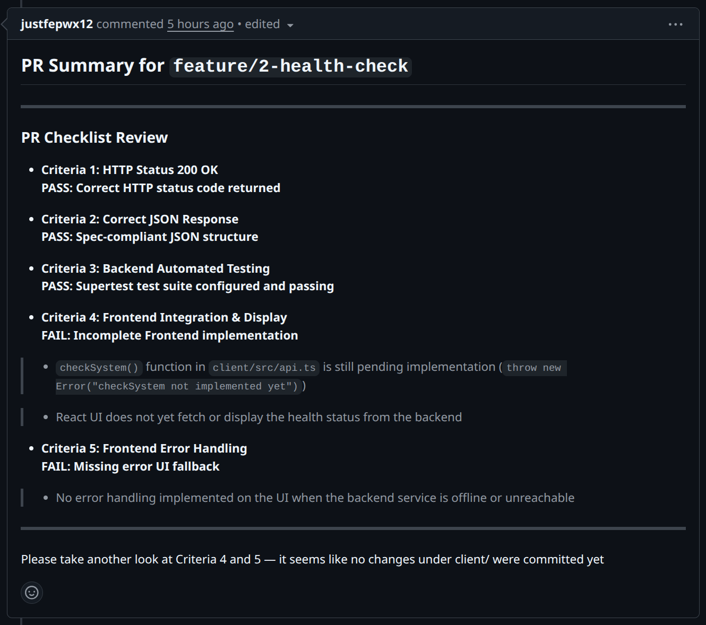
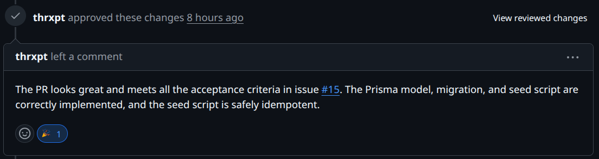
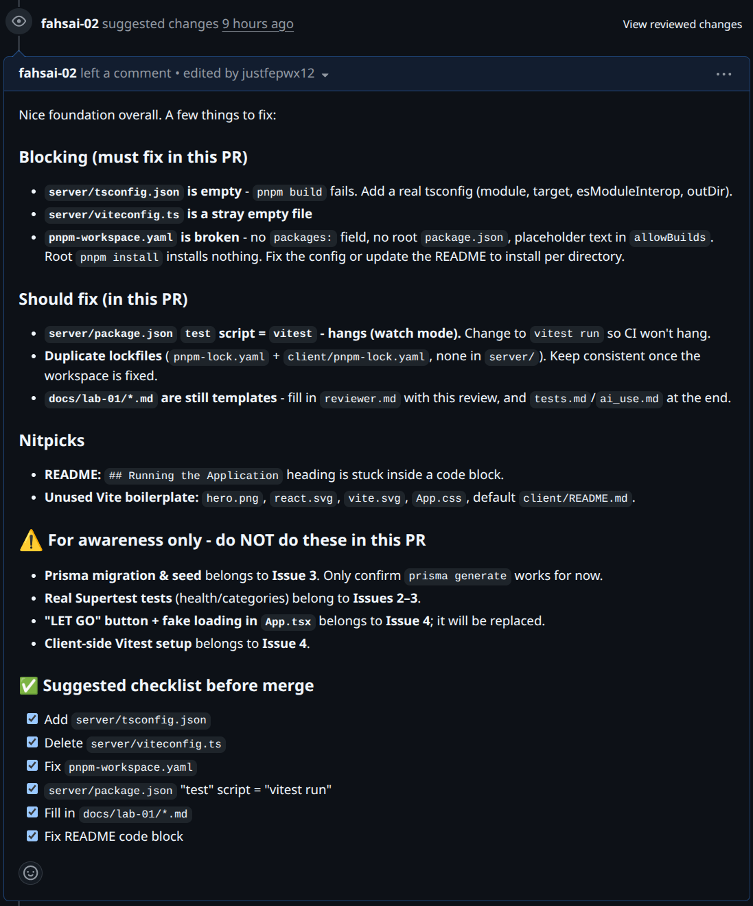
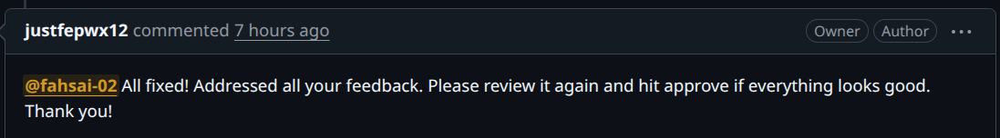
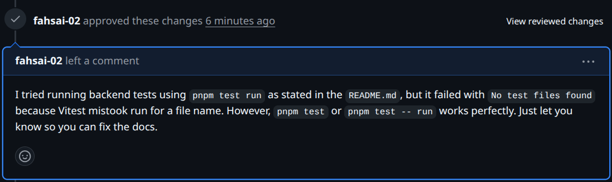

# Lab 1 — Peer Review Record  (fill this in)

**Author:** Nakagamon Saengdara — 67070501064 — GitHub: @fahsai-02

## Pull Requests I authored (reviewed by my partner)
| PR | Branch | Reviewer verdict |
|----|--------|------------------|
| 17 | feature/1-project-foundation | approved |
| 21 | feature/2-health-check | commented |
| 25 | feature/3-category-seed | approved |
|    | feature/4-category-list |  |

### #17 feature/1-project-foundation

**Peer reviewer:** Onsinee Chotchuangsakulchai — 67070501078 — GitHub: @justfepwx12

Reviewer comment I received: 

---
How I responded: 

---
Reviewer approved comment : 

---

### #21 feature/2-health-check

**Peer reviewer:** Onsinee Chotchuangsakulchai — 67070501078 — GitHub: @justfepwx12

Reviewer comment I received: 

---

How I responded: 

### #25 feature/3-category-seed

**Peer reviewer:** Theeraphat Jaingam — 67070501063 — GitHub: @thrxpt

Reviewer approved comment : 

---

## Pull Requests I reviewed for my partner

### #17 feature/1-project-foundation
My comment:

---

Partner's response:

---

My approved comment:

---
